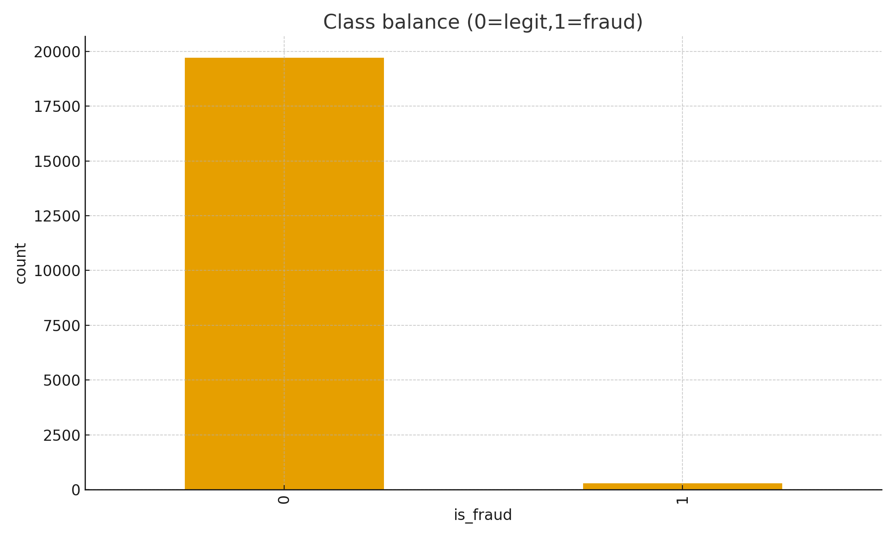
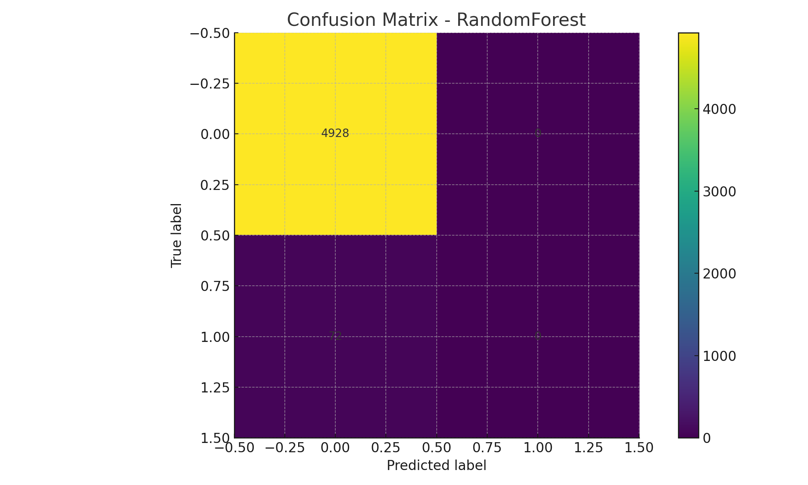

# Fraud Detection Model

This repository contains the code and documentation for the **Fraud Detection Model** project. The goal of the project is to develop a machine learning-based system capable of identifying fraudulent financial transactions using **Logistic Regression** and **Random Forest** algorithms. The project showcases key aspects of **imbalanced classification**, **data preprocessing**, and **model evaluation**.

---

## Project Overview

The **Fraud Detection Model** project applies machine learning techniques to detect fraudulent transactions from a financial dataset. The model is trained to classify transactions into **fraud** and **non-fraud** categories. Given the highly imbalanced nature of the dataset (with a fraud ratio of just 1.44%), special attention was given to handling the class imbalance and evaluating the model's performance on the fraud class.

---

## Dataset

- **Number of Rows**: 20,000
- **Number of Features**: 30 (e.g., transaction amount, time, etc.)
- **Fraud Ratio**: 1.44% (indicating highly imbalanced data)

The dataset is synthetic, designed specifically for fraud detection challenges, and includes both legitimate and fraudulent transactions.

---

## Key Models Implemented

### 1. Logistic Regression

- **ROC AUC**: 0.5504  
- **Confusion Matrix (Test Data)**:
```

[[4928    0]
[  72    0]]

```
- **Fraud Class (1) Performance**:
- **Precision**: 0.0000
- **Recall**: 0.0000
- **F1-Score**: 0.0000

Logistic Regression serves as a baseline model. Despite achieving a moderate ROC AUC, it struggled to detect fraudulent transactions effectively due to class imbalance.

### 2. Random Forest

- **ROC AUC**: 0.4509  
- **Confusion Matrix (Test Data)**:
```

[[4928    0]
[  72    0]]

````
- **Fraud Class (1) Performance**:
- **Precision**: 0.0000
- **Recall**: 0.0000
- **F1-Score**: 0.0000

While Random Forest showed a slight improvement in ROC AUC, the model similarly struggled with detecting fraud, highlighting the need for further improvements in data handling and model optimization.

---

## Key Insights & Challenges

- **Class Imbalance**: Both models showed limitations in detecting fraud due to the highly imbalanced nature of the dataset, with fraud accounting for only 1.44% of the total transactions.

- **Model Performance**: Despite reasonable ROC AUC scores, the models performed poorly in detecting fraud (class 1), indicating that additional techniques such as **SMOTE** (Synthetic Minority Over-sampling Technique) or **ensemble methods** are needed to improve performance on imbalanced datasets.

- **Evaluation Metrics**: While ROC AUC was used to evaluate the overall performance, other metrics such as **Precision**, **Recall**, and **F1-Score** should be given more focus for the fraud class to ensure real-world applicability.

---

## Visualizations

### Class Balance

The dataset had a highly imbalanced class distribution. Here’s a visualization of the class balance:



### Confusion Matrix (Random Forest)

The confusion matrix for the Random Forest model, showing the model’s limited ability to detect fraudulent transactions:



---

## Installation & Setup

### Clone the repository

To get started, clone the repository to your local machine:

```bash
git clone https://github.com/your-username/Fraud-Detection-Model.git
````

### Install Dependencies

Make sure to install the required libraries by running:

```bash
pip install -r requirements.txt
```

---

## Usage

1. Open the Jupyter notebook `fraud_detection.ipynb` to view the implementation.
2. Run the notebook cells to train the model, evaluate its performance, and generate visualizations.
3. The models will be trained on the synthetic dataset, and you will see metrics like **ROC AUC**, **Confusion Matrix**, and other evaluation results for both models.

---

## Project Report

For a detailed explanation of the methodology, evaluation, and conclusions, refer to the **project report** (`fraud_project_report.md`). The report provides in-depth insights into the model development process.

---

## Future Work

* **Resampling Techniques**: Implement techniques like **SMOTE** (Synthetic Minority Over-sampling Technique) to better handle the class imbalance in the dataset.
* **Model Improvement**: Experiment with more advanced models such as **XGBoost** or **Neural Networks** to improve fraud detection accuracy.
* **Hyperparameter Tuning**: Fine-tune the model parameters using grid search or random search to optimize performance.
* **Feature Engineering**: Further feature selection and engineering can improve model performance by removing irrelevant or highly correlated features.

---

## Acknowledgments

* Thanks to **Zidio** for providing the opportunity to work on this project and gain hands-on experience in machine learning and fraud detection.

---

## Team & Credits

* **Project Lead**: Tejas Solanki
* **Contributors**: Tejas Solanki, Sonu Kumar, Nirgun Joshi, Rupak Lipane, Rony Varghese
* **Special Thanks**: Open source libraries (Yahoo Finance, pandas, scikit-learn, TensorFlow, Streamlit, etc.)

---

## License

This project is licensed under the MIT License - see the [LICENSE](LICENSE) file for details.

---

### Conclusion

This GitHub repository showcases a **Fraud Detection Model** designed to identify fraudulent financial transactions. The project provides valuable insights into working with imbalanced datasets and applying machine learning algorithms in real-world applications. Future improvements will focus on enhancing model performance by addressing class imbalance and experimenting with more advanced techniques.
